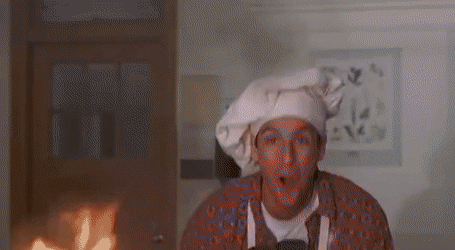
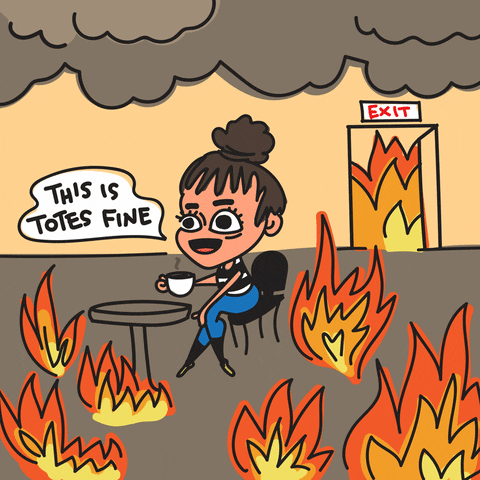
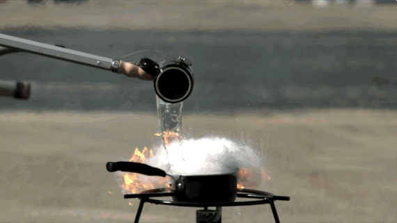

<html>
<h1>Grease Fire Protocall.</h1>
 
Lets say you have a grease fire.
 

Here is what NOT to do:
 

 
Or:
 

 
Because then you will die and who would want that?
 
Don't put water on it either:
 

 
Fire extinguishers are also bad. Not only will you have a grease fire, now you just shot it across the room and into the wall!
 
The proper
